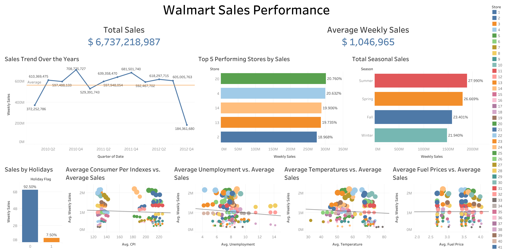

# Walmart Retail Sales EDA (SQLite)

## 1. Project Overview
This project explores weekly sales data from a large retail company, Walmart, using SQLite and Tableau. The objective is to analyze how internal and external factors, such as seasonality, holidays, temperature, fuel prices, CPI, and unemployment, influence revenue.

The analysis focuses on identifying sales trends over time, evaluating seasonal performance, and examining the potential impact of economic indicators on store performance.

## 2. Dataset Description
The dataset contains the following variables:
- `Store` – Store identifier  
- `Date` – Week start date (MM/DD/YYYY)  
- `Weekly_Sales` – Sales for the given week  
- `Holiday_Flag` – 1 if holiday week, 0 otherwise  
- `Temperature` – Regional air temperature  
- `Fuel_Price` – Regional fuel price  
- `CPI` – Consumer Price Index  
- `Unemployment` – Regional unemployment rate

## 3 Data Cleaning & Preparation
Before beginning exploratory analysis, the dataset was cleaned and standardized to ensure proper analysis and findings, which include:
- Verified missing values across all columns
- Standardized date format for seasonal and yearly analysis
- Checked for duplicate records
- Validated numeric columns for inconsistencies
- Derived seasonal categories (Winter, Spring, Summer, Fall) from month values

## 4. Business Questions
This analysis aims to answer business questions such as:
- How do sales change over time?
- Do holidays increase weekly sales?
- Which season generates the highest revenue?
- Do temperature and fuel prices impact store performance?
- Is there a relationship between economic indicators and sales?

## 5. Key Analyses Performed
The following exploratory analyses were conducted using SQLite:
- Yearly sales aggregation and trend analysis
- Holiday vs non-holiday comparison
- Seasonal sales analysis and comparison (Winter, Spring, Summer, Fall)
- Sales comparison against economic indicators (CPI and Unemployment)
- Store-level performance evaluation

## 6. Key Findings
### 6.1. Data Cleaning
There are no null values or duplicates presented in the dataset. Therefore, there is no data cleaning and standardization performed in this dataset, except for having the data format structured during seasonal analysis 

### 6.2. Basic Statistics
In the dataset, we have found out about the `Sales` and `Temperature`:
- The average `Sales` in this dataset is about $USD 1,046,965, with $USD 209,986 being the minimum and $USD 3,818,686 being the maximum sales.
- The average `Temperatures` in this dataset is about 60.63 Celsius, with -2.06 Celsius being the lowest temperature and 100.14 Celsius being the highest temperature.

### 6.3. Sales Trends Over the Year
| Year | Total Sales | Avg Weekly Sales |
|--------|------------|-----------------|
| 2010 | 2,288,886,120.41| 1,059,669.50 |
| 2011 | 2,448,200,007.35 | 1,046,239.32 |
| 2012 | 2,000,132,859.35   | 1,033,660.39 |

Based on the result presented in the table, the total sales of Walmart peaked in 2011 before declining in 2012. However, average weekly sales remained relatively stable across years, indicating consistent weekly performance of Walmart despite annual fluctuations.

### 6.4. Weekly Sales by Store
| Store | Total Sales | 
|--------|------------|
| 20 | 2,107,676.87 | 
| 4 | 2,094,712.96 | 
| 14 | 2,020,978.40 | 

Store 20 demonstrates the highest average weekly sales, followed closely by Stores 4 and 14, suggesting strong location-based performance differences.

### 6.5. Holiday Effect on Store
<strong>Finding:</strong>
`Holiday_Flag` = 0 (non-holiday weeks) shows higher average weekly sales compared to holiday weeks.

While holiday periods are typically associated with increased consumer spending, the dataset suggests that non-holiday weeks generate stronger average sales performance.

### 6.6. Macroeconomic Influence (CPI and Unemployment)
| Store | Avg Sales    | Avg CPI | Avg Unemployment |
| ----- | ------------ | ------- | ---------------- |
| 20    | 2,107,676.87 | 209.04  | 7.37             |
| 4     | 2,094,712.96 | 128.68  | 5.96             |
| 14    | 2,020,978.40 | 186.29  | 8.65             |
| 13    | 2,003,620.31 | 128.68  | 7.00             |
| 2     | 1,925,751.34 | 215.65  | 7.62             |

There is no strong, visible direct relationship between higher CPI or unemployment and sales performance. Economic indicators vary across stores but do not clearly explain the differences in average weekly sales of Walmart.

### 6.7. Seasonal Sales
```sql
SELECT 
    CASE 
        WHEN substr(Date, 4, 2) IN (12, 1, 2) THEN 'Winter'
        WHEN substr(Date, 4, 2) IN (3, 4, 5) THEN 'Spring'
        WHEN substr(Date, 4, 2) IN (6, 7, 8) THEN 'Summer'
        WHEN substr(Date, 4, 2) IN (9, 10, 11) THEN 'Fall'
    END AS season,
    SUM(Weekly_Sales) AS total_sales,
    AVG(Weekly_Sales) AS avg_sales
FROM sales_staging
GROUP BY season
ORDER BY total_sales DESC;
```

<strong>Results:</strong>
| Season | Total Sales      | Avg Weekly Sales |
| ------ | ---------------- | ---------------- |
| Summer | 1,885,721,072.91 | 1,047,622.82     |
| Spring | 1,796,771,258.20 | 1,023,801.29     |
| Fall   | 1,576,561,691.86 | 1,030,432.48     |
| Winter | 1,478,164,964.14 | 1,094,937.01     |

Summer generates the highest total sales overall, while Winter shows the highest average weekly sales. This suggests seasonal demand variations, potentially influenced by holiday and end-of-year consumer behavior.

### 6.8. Walmart Sales Performance Dashboard
The dashboard provides an overall analysis of Walmart’s weekly sales performance across multiple stores, examining trends over time and the influence of external factors such as seasonality, holidays, temperature, fuel prices, and key economic indicators (CPI and unemployment).

#### Dashboard Preview:


#### Key Insights:
- Sales peaked in Quarter IV 2010 and declined slightly in Quarter I 2011
- Summer generates the highest total revenue
- Holiday weeks do not always increase sales
- Economic indicators show weak correlation with sales

#### View Dashboard:
https://public.tableau.com/views/WalmartSalesEDA/WalmartSalesPerformance?:language=en-GB&:sid=&:redirect=auth&:display_count=n&:origin=viz_share_link

## 7. Conclusion
In conclusion, the analysis reveals the consistency of weekly sales performance with noticeable seasonal and store-level differences. While total revenue fluctuates by year, the average weekly sales of Walmart remain relatively stable. Seasonal patterns are evident, with winter showing the highest average weekly sales and summer contributing the highest total revenue.

Holiday periods and macroeconomic indicators such as CPI and unemployment show a limited direct impact on Walmart's overall performance. Overall, sales appear to be more strongly influenced by seasonality and store-specific factors than short-term economic changes.
